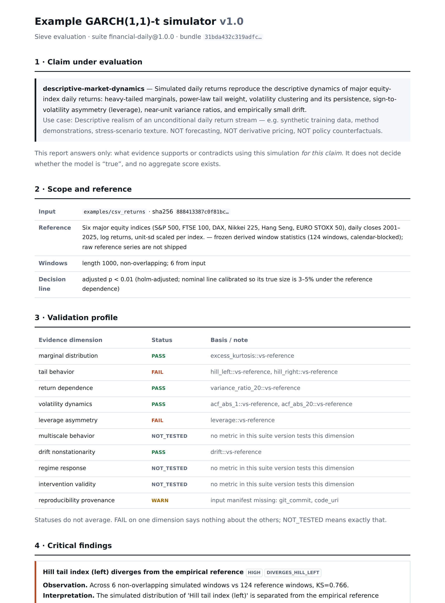

# Sieve

**What does your simulation actually prove?**

Sieve tests simulation claims against empirical reference distributions and
known simpler baselines, then writes a sealed, independently verifiable
evidence bundle. Locally, offline, in seconds. There is no score.

Example: a calibrated GARCH(1,1)-t simulation reproduces volatility
clustering but **fails leverage asymmetry — exactly the mechanism it does not
contain**. And on the volatility metrics it passes, the report says on the
same row that those metrics cannot separate GARCH from real markets either:

[](https://htmlpreview.github.io/?https://github.com/yuitokyouni/sieve/blob/main/docs/example-run/report/index.html)

Read that exact report in your browser
([rendered](https://htmlpreview.github.io/?https://github.com/yuitokyouni/sieve/blob/main/docs/example-run/report/index.html) ·
[files](docs/example-run/)), or verify its integrity without running anything:

```
git clone https://github.com/yuitokyouni/sieve && cd sieve
pip install -e .                # or: uv pip install -e .
sieve verify docs/example-run   # recomputes the seal + every artifact hash
```

Reproduce it from scratch — same statuses, and (with the pinned package
versions) the same `bundle_hash`, on your machine:

```
sieve test examples/csv_returns --suite financial-daily@1.0 --claim descriptive-market-dynamics
```

See [docs/reproduce.md](docs/reproduce.md) for the exact reproduction
contract and expected hashes.

## What a run produces

```
manifest.json                     run identity, seed tree, environment
observations.parquet              per-window metric values (the raw evidence)
results.json                      per-metric tests: KS, p, adjusted p, status
findings.json                     FAILs turned into author-actionable findings
artifacts/baseline_context.json   which baselines each metric cannot separate
report/index.html                 the report, readable without Sieve
evidence_bundle.json              everything above, in one sealed schema
bundle.sha256                     sha256sum-compatible integrity sidecar
```

## What a result means

- **A claim, not a model, is evaluated.** `descriptive-market-dynamics` asks
  whether the input reproduces the descriptive dynamics of major equity-index
  daily returns — nothing else. Statuses answer "does the evidence support
  using this simulation *for this claim*".
- **Ten evidence dimensions, never averaged.** Each dimension ends at PASS,
  FAIL, WARN, NOT_TESTED or INSUFFICIENT. `NOT_TESTED` and `INSUFFICIENT`
  are first-class answers. There is no overall score anywhere in the system,
  by design and by test (`tests/unit/test_no_score.py`).
- **PASS is calibrated, and disclosed as weak where it is weak.** The decision
  line (α = 0.01, Holm-adjusted) is the nominal level whose *measured* true
  size is 3–5% under the reference dependence structure — a naive permutation
  test rejects 56% at nominal 5% on this design, so Sieve does not use one.
  Every PASS row also lists which shipped baselines that metric *cannot*
  separate from the reference.
- **Post-hoc diagnostics are labeled.** Two suite metrics (`variance_ratio_20`,
  `drift`) were added to the research battery after calibrated agent-based
  models exposed failures the original battery could not see. They carry a
  POST HOC badge in every report — disclosure, not confession.
- **Bundles are sealed twice.** `bundle_hash` pins *what was measured* — data
  content hash, suite hash, claim, seed tree, results — and excludes run IDs,
  timestamps, filesystem paths and the machine fingerprint, so the same input
  bytes with the same suite, seed and package versions reproduce the same
  seal on any machine. `bundle.sha256` pins *what was shipped*: the exact
  files, including every artifact hash; `sha256sum -c bundle.sha256` works
  with no Sieve installed. `sieve verify` checks both layers and reports
  tampering as a result, not a crash. Design history in
  [docs/architecture.md](docs/architecture.md).

## Scope — what this suite can assess

`financial-daily@1.0` assesses **long-horizon daily return simulations**: it
needs at least five non-overlapping windows of 1000 daily observations
(≈ 20 years). That is the honest requirement for distribution-over-windows
testing against the shipped reference; shorter inputs get INSUFFICIENT, which
is an answer, not an error.

It follows that Sieve does not claim "any simulation can be adapted". A
claim needs a suite whose evidence matches it. A limit-order-book or
market-microstructure simulation should not be forced to emit 20 years of
daily returns — it needs its own claims and its own tests (spread, depth,
order-flow imbalance, impact, inventory response), which is future suite
work, not an adapter:

```
Sieve Core
│
├── financial-daily            (this release)
│   └── descriptive-market-dynamics
│
├── market-microstructure      (planned)
│   ├── descriptive-lob-dynamics
│   └── execution-response
│
└── ...
```

The architecture makes this natural rather than inconvenient: evidence is
claim-scoped, so different simulation kinds get different suites instead of
one universal "realism" test.

## Where the science comes from

The metrics, baselines, reference statistics, calibrated inference and every
disclosed blind spot are migrated verbatim from the
[sieve-bench research repository](https://github.com/yuitokyouni/sieve-bench),
and golden regression tests pin the product to it bit-for-bit
(`tests/golden/`). The suite ships *derived* window statistics (124 reference
windows × 8 metrics, with calendar blocks and per-index source hashes) — raw
index data is neither shipped nor fetched.

Baselines declare their mechanisms explicitly (`sieve baselines list`):
`gaussian` (nothing), `student_t` (heavy tails only), `iid_bootstrap`
(marginal only), `block_bootstrap` (marginal + short memory), `garch_norm`
(clustering only), `garch_t` (clustering + heavy tails, no asymmetry).

## What Sieve will not do

No reality score. No model rankings or leaderboards. No "certified" badges.
No generic LLM evaluation. No uploading of proprietary code or data. No
arbitrary remote code execution. These are product invariants, not roadmap
gaps; the no-score invariant is enforced by tests.

## CLI

```
sieve doctor                 environment + suite check (offline, no network)
sieve test INPUT --suite S --claim C [--out DIR] [--seed N]
sieve verify RUN_DIR         exit 0 intact / 4 modified / 3 missing
sieve report RUN_DIR         re-render HTML from the stored bundle
sieve suites list|show       installed suites, their hashes and claims
sieve metrics list|show      metrics with dimensions and known blind spots
sieve baselines list         baselines with declared mechanisms
sieve schemas export         JSON Schema for every durable artifact
```

Exit codes separate evaluation from execution: a model FAILing a dimension is
a *result* (exit 0); only invalid input (2), missing pieces (3), tampering
(4) or a Sieve bug (1) are errors.

## Input contract (Tier 0)

`returns.csv` with columns `timestamp,return` (daily log returns), 50+ rows,
optionally a `manifest.yaml` with model identity, parameters, `git_commit`,
`code_uri`. Anything you do not state is recorded as absent — provenance gaps
appear in the report rather than being silently filled.

## Status

v0.1.0: the offline golden path above is complete and tested (78 tests,
including cross-path determinism, both tamper layers and bit-for-bit parity
with the research repository). `STATUS.md` maps every acceptance criterion to
its test; `docs/architecture.md` records design decisions including the two
seal-scope corrections found by our own audit tests.
